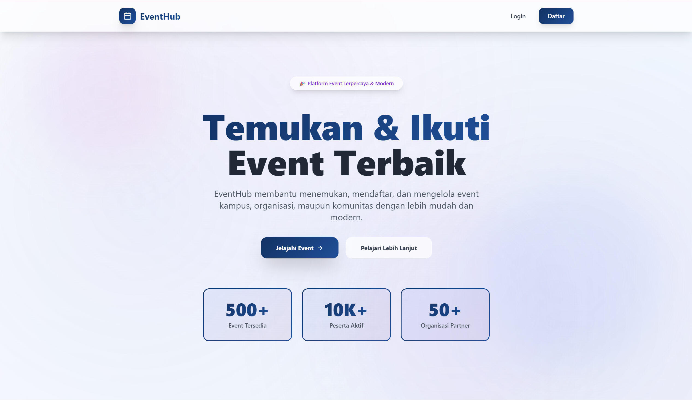
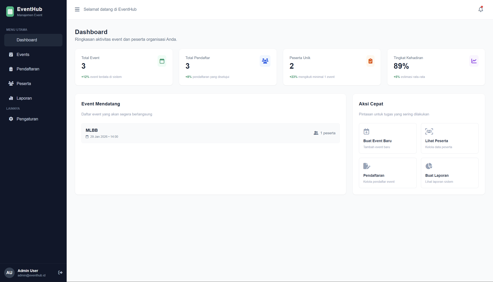

Kelompok 23:
1. Daniel Siahaan (Ketua) - 2315061053
2. Annisa Dina Maharani - 2315061041
3. Erlin Sari Ramadhani - 2315061056
4. Eugenia Grasela Maia - 2355061008

"EventHub: Sistem Informasi Manajemen Event Berbasis Web dengan Fitur Registrasi Digital dan Dashboard Admin Terintegrasi"

EventHub adalah sistem informasi berbasis web yang dirancang untuk mempermudah proses pengelolaan event dalam lingkungan organisasi, komunitas, maupun institusi pendidikan. Platform ini menyediakan landing page publik untuk menampilkan daftar event serta akses registrasi bagi anggota yang telah memiliki akun.

Pada sisi administratif, EventHub memiliki dashboard admin yang lengkap mencakup manajemen event, pendaftaran peserta, verifikasi registrasi, pengelolaan data peserta, dan pembuatan laporan yang dapat diekspor. Sistem ini mendukung upload poster event, pengaturan kuota, kategorisasi event, dan penjadwalan yang terstruktur.

Platform ini juga dilengkapi modul autentikasi yang aman dengan enkripsi password, pencatatan riwayat login (login logs), serta halaman pengaturan akun (settings) yang mencakup pembaruan profil, upload foto, preferensi notifikasi, dan perubahan password. Dengan arsitektur berbasis PHP, MySQL, dan TailwindCSS, EventHub menjadi solusi modern untuk digitalisasi manajemen event secara efisien, terstruktur, dan fleksibel.

Cara menjalankan website Eventhub:

A. Integrasi Database
1. Aktifkan XAMPP/Laragon agar database bisa digunakan (hidupkan Apache dan MySQL)
2. Buka halaman MySQL dari XAMPP lewat admin
3. Buat database baru dengan menginputkan sintaks yang ada di file "database.txt" ke menu SQL dan klik GO
4. XAMPP akan membuat database baru bernama "eventhub" beserta isinya

B. Menjalankan website Eventhub
1. Download file project di github dan ekstrak zipnya
2. Buka melalui Code Editor seperti VSCode atau Code Editor lainnya
3. Setelah itu tinggal buka file "index.php" sebagai landing page lewat localhost, atau file "dashboard.php" sebagai dashboard admin
4. Akun admin untuk mengakses laman dashboard
    Email address   : daniel@gmail.com
    Passwordd       : daniel45

5. Selesai

Catatan:
File source code tersebut sebelumnya harus dimasukin di dalam folder htdocs di C

Dokumentasi website:
1. Landing Page

2. Login/Daftar

3. Dashboard Admin beserta Laman lainnya

ERD

